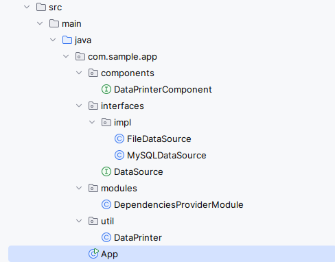

### Hello World project for Dagger (Dependeny Injection library).



[run_mvn_exec.sh](run_mvn_exec.sh)
````shell
mvn exec:java
````

````shell
./run.sh

hello world!!!!!
Hi there!!!!!
````

### Package executable jar

[package.sh](package.sh)

````shell
mvn clean package
````

### Run Jar

Java 11

[./run_jar.sh](./run_jar.sh)

````shell
java -jar target/dagger-hello-world-1.0.0-jar-with-dependencies.jar
````


### Links:

[Описание Dagger (v.perm.ru)](https://v.perm.ru/index.php/component/content/article/dagger?catid=15)<br/>
[https://dagger.dev/dev-guide/](https://dagger.dev/dev-guide/)<br/>
[https://www.baeldung.com/dagger-2](https://www.baeldung.com/dagger-2)
